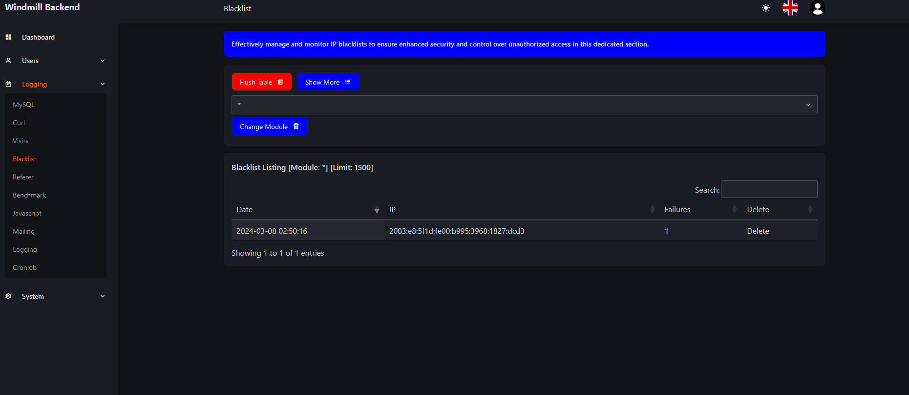

# "Windmill" Simple Backend
This is a simple backend featuring the windmill theme. It can act as a background admin panel for your deployed websites to get some insights and debugging informations. As much as control user management and more! You can copy this template and use this for your own project if required.   

You can also look inside this site module to get insights on how to build an admin panel using the windmill theme with fast-php-page cms!
This module includes the Fast-PHP-Page Documentation as a module to be deployed in the Fast-PHP-Page CMS. You can find the repository of the CMS itself here: https://github.com/bugfishtm/fast-php-page.

## Installation

To integrate this Fast PHP Page Module into your website, you have two installation options:

### Manual Installation
1. Download the repository to your local machine.
2. Extract the latest module version from the `_releases` folder.
3. Move the extracted folder to the '_site' directory of your Fast-PHP-Page website.
4. Execute the site using an admin module to switch to a website module or via commands in `cfg_ruleset.php`.
5. We recommend initializing the site once to install any required databases or necessary installation procedures.

### Download from Store
1. Log in to the Fast PHP Page `_administrator` module or another capable module with store access.
2. Navigate to the Store and select the module you wish to install via the web interface.
3. Download and install the module through the administrator interface.
4. Configure your module within the modules section of the administrator interface or another compatible administrative module.

## Repository Structure
- `.git`: Repository-related information.
- `.github`: Sponsorship-related files.
- `_releases`: Module installation files for administrative interfaces or manual installation.
- 'modulename': Module-specific folder for administrative installations, with installable releases available in the `_releases` folder.
- `_images`: Images for the readme file and documentation.
- `CONTRIBUTING.md`: Guidelines on contributing to this project.
- `LICENSE.md`: Licensing information for this module's code. Please refer to the Fast PHP Page documentation for information on any third-party licenses used.
- `README.md`: The document you are currently viewing.

## Reporting Issues
Should you encounter any issues or have inquiries while using this software, please feel free to reach out to us on our forum at [www.bugfish.eu/forum](www.bugfish.eu/forum). Alternatively, you can submit your queries via the GitHub Issues section in this project's repository.

## 3rd Party Libraries
This project utilizes various third-party libraries (e.g., jQuery), all included in the website's `/_vendor` folder along with their respective licenses. The development of this project is facilitated by the "Bugfish Framework" and the "Fast PHP Page" Backend CMS.

 

Please note that this module may incorporate third-party theme libraries and images, each subject to different licenses. For details on licenses included in this product, refer to the Fast PHP Page CMS documentation.

Documentation:
- Fast-PHP-Page: [Documentation](https://www.bugfish-github.de/fast-php-page)
- Bugfish Framework: [Documentation](https://www.bugfish-github.de/bugfish-framework)

## License Information
For licensing details, kindly consult the `LICENSE.md` file within this repository's folder. The license applies to the code within this module. However, please be aware that the module might include images or code subject to different licenses. If third-party licenses or products are utilized, refer to the aforementioned section for details.